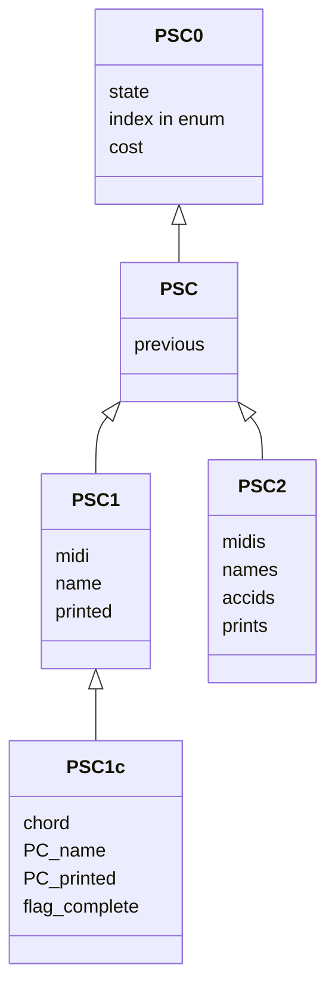

# PSE algorithm
structures for tabulation in Pitch Spelling algorithm.
use measural info (bar numbers).


## table (`PST`)

```
      bar_0     ...    bar_n
      
      PSV_0     ...    PSV_n
TON0  PSB_0,0          PSB_n,0
.       .                .
.       .                .
.       .                . 
TONk  PSB_0,k          PSB_n,k
```

## classes  

-   `PSState` (1 alteration (in -2..2 + UNDEF) / note name in 0..6)
    -   constructor(ton, true) : = key sig.
    -   constructor(ton, false) : jokers for minor (sensible…)  
         not counted in cost

-   `PSC0` (PS Config source)
    -   accid. state
    -   [private] cumul nb accid.
    -   [private] cumul dist.
    -   cost() sum of the 2 above = nb accidents
    -   prev
    -   alt(name)  (access to state)
    -   successor(Pitch, Ton, [queue&])

-   `PSC` (PS Config) = PSC0 + 
    -   name
    -   printed (flag)
    -   id last note read
    -   alt() (from state and name)
    -   unfold() = stack of configs to this config

-   `PSB` (bag of PS Configs)
all the configs in the bag have the same weight
all the configs in the bag have the same source
    -   cost the cost value of every PS Config

-   `PSV` (vertical vector of `PSB`s, one `PSB` for each tonality)
    -   static `TON[]` vector of tonalities (some size as the PSV). 
        = order of enum of vector
    -   static `ALTSTATE`s key sigs and sensibles for tons in `TON`.
    -   `enum` : note enumerator
    -   first note
    -   note after last note
    -   constructor (3 above args)
    -   local tonality (index in TON) (initially UNDEF)
    -   `updateLocal` (prev._local)  
        collecte ensemble des index de TON de cout min dans la colonne  
        si plusieurs, choisit celle la plus proche de prev._local  
        second tie break ?
    
- `PST` table = vector of `PSV`s

-   `PSP` (path of PS Configs)  
    idem actuel


## classes of configurations



